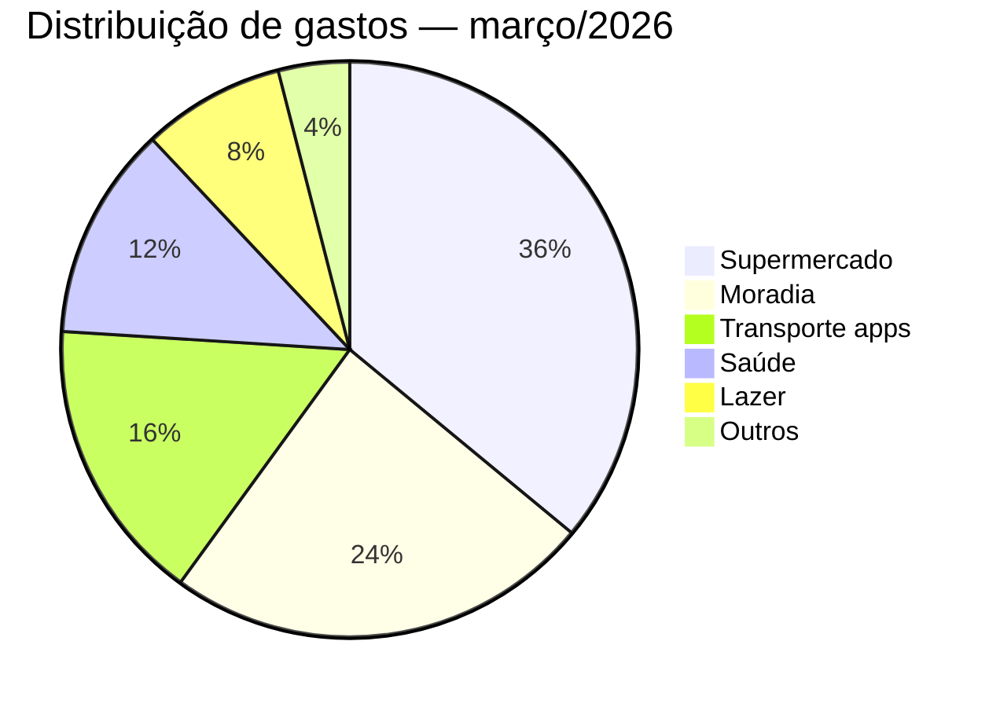
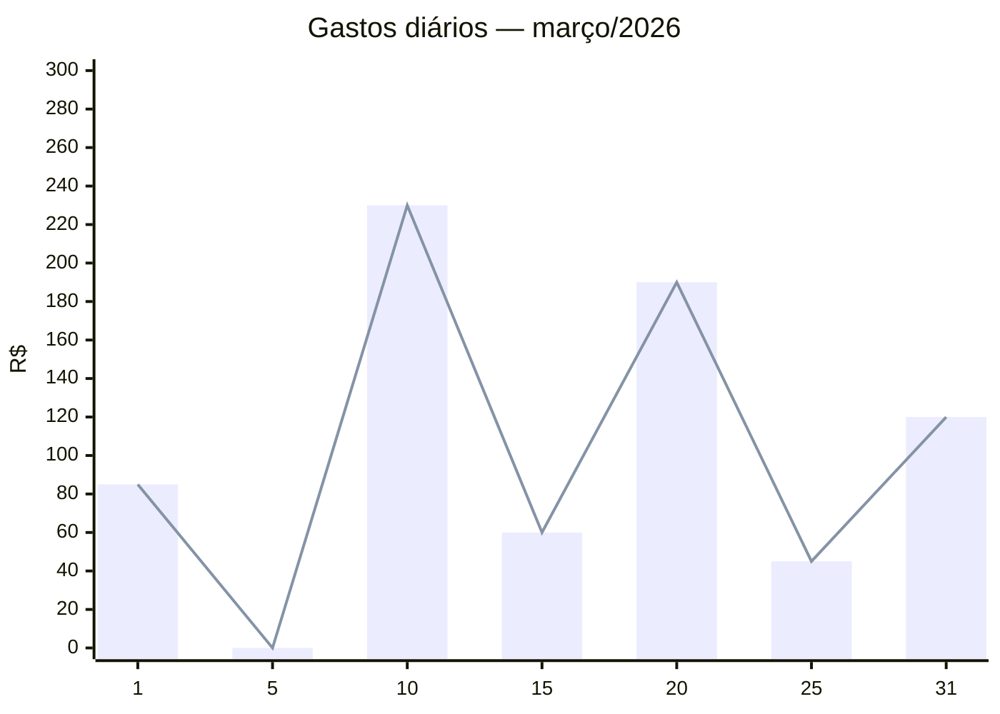

# Design Decisions

## Analytics endpoints

### Por que `by_category` está dentro do `summary` e não é um endpoint separado

Categorias são um conjunto fixo e pequeno (máx 16). O payload nunca cresce independente do volume de despesas, então não há custo em retornar junto com o resumo do mês.

No front, o `summary` alimenta a tela home inteira com uma única requisição:

- **Card de total do mês** — campo `total`
- **Gráfico de pizza/donut** — campo `by_category` com `total` por categoria
- **Ranking de gastos** — `by_category` já vem ordenado por `total` decrescente, pronto para renderizar uma lista "onde você mais gastou"
- **Card de destaque** — "você gastou mais em Supermercado esse mês" usando o primeiro item de `by_category`



---

### Por que `daily` retorna só agregação e não a lista de despesas

Um mês tem até 31 dias. Se cada dia trouxesse a lista de despesas, o payload seria `n dias × m despesas` — podendo facilmente passar de 100 itens em uma única chamada.

O `daily` serve exclusivamente para visualizações de tendência:

- **Gráfico de linha ou barras** — evolução do gasto dia a dia ao longo do mês
- **Heatmap de gastos** — intensidade de gasto por dia (estilo GitHub contributions)



Para ver as despesas de um dia específico (ex: usuário toca em uma barra do gráfico), o front faz uma segunda chamada para `GET /api/expenses` com filtro de data — endpoint a implementar. Assim cada endpoint tem uma responsabilidade clara e o `daily` permanece leve.

---

### Fluxo de telas sugerido

```
Tela Home
├── GET /api/analytics/summary?month=YYYY-MM
│   ├── card: total do mês
│   ├── gráfico de pizza: by_category
│   └── ranking: top categorias
│
├── GET /api/analytics/daily?month=YYYY-MM
│   └── gráfico de linha: evolução diária
│
└── [tap em um dia do gráfico]
    └── GET /api/expenses?month=YYYY-MM&date=YYYY-MM-DD  ← a implementar
        └── lista de despesas do dia
```
